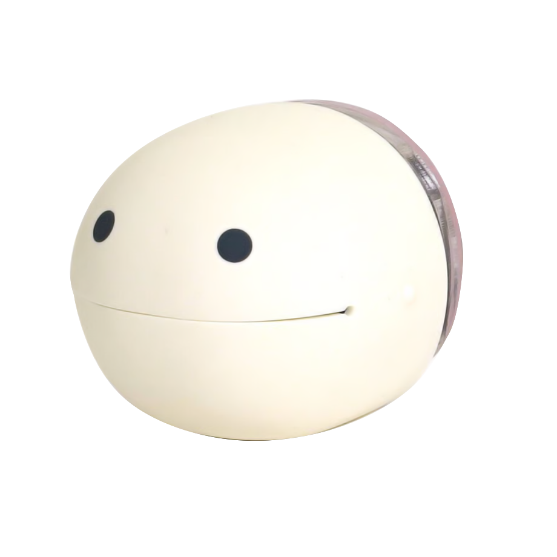
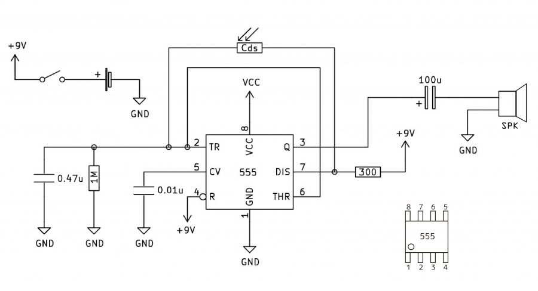

# ⊹˚₊ 𝄢 ♬˚₊‧ CASE 01: OTAMAMIN - Study of a light instrument ‧₊˚♪ 𝄞 ₊˚⊹ (English)

## Introduction

Earlier this year (2025) ...

***

▼ Description. Source: ---

---------------------------------------------------------------------------------------
# ⊹˚₊ 𝄢 ♬˚₊‧ CASO 01: OTAMAMIN - Estudio de un instrumento de luz ‧₊˚♪ 𝄞 ₊˚⊹ (Español)

## Introducción

A principio de este año (2025) conocí este objeto en un curso sobre [circuitos eléctricos](https://github.com/disenoUDP/dis8644-2025-1-proyectos). Su simpleza y diseño me cautivaron, por lo que quise tener uno propio. Por ello me dispuse a estudiar este objeto para poder fabricar una réplica.

Al navegar por la página de la empresa pude encontrar una [noticia en la que hablan sobre el producto](https://www.maywadenki.com/news/otamamin/), además de poner a disposición el diagrama del circuito. Al revisar pude aclarar mis dudas sobre las piezas específicas.

En comparación con el producto lanzado al mercado, este circuito posee un interruptor en conjunto con 2 resistencias que hacen que sensor LDR permita traspasar más o menos energía. Tras abrir el objeto pude ver que este posee un potenciometro con un switch como parte de su mecanísmo. 

***

▼ Maywa Denki Store (s.f.) Otamamin [fotografía]. Maywa denki (https://maywadenki.stores.jp/items/62d935150f683c60cb6ade4d).

▼ Maywa Denki Store (s.f.) Otamamin [fotografía]. Maywa denki (https://maywadenki.stores.jp/items/62d935150f683c60cb6ade4d).
